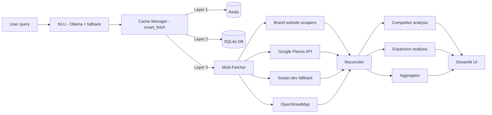
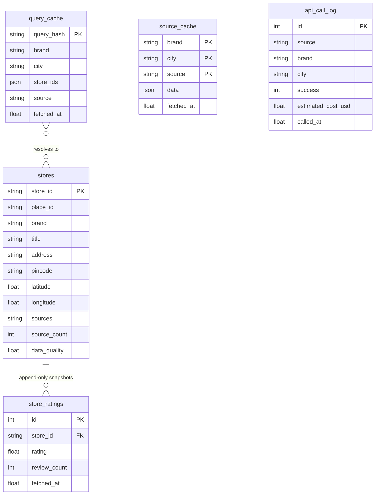
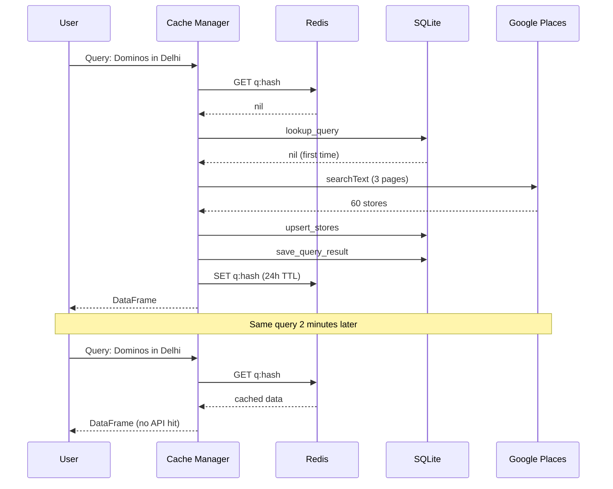

# Architecture

This document is the technical reference for Location Intelligence.
The top-level `README.md` is the front door; this file is for operators and
contributors who need to reason about how the parts fit together.

## 1. Main data flow

Every user query travels the same path. NLU turns plain English into a
structured parameter set, the cache manager resolves each
`(brand, city)` through a three-layer stack (Redis hot cache → persistent
SQLite → live API adapters), the reconciler collapses multi-source
duplicates, and three parallel analytical passes produce the final
tables and memo points.



Key rules baked into the flow:

- **DB is primary; APIs are last resort.** A repeat query within the TTL
  never hits a paid API. The cost telemetry in `api_call_log` makes this
  easy to verify.
- **Google Places is the primary maps source; Serper is a fallback.** Per
  city, Serper only fires if Places came back empty. This is enforced in
  `multi_fetcher.fetch_multi_source`.
- **Brand websites run first when available.** They're free and have the
  cleanest addresses, so first-party data sets the baseline and `google_places`
  / `serper` add ratings and review counts on top.

## 2. Persistent DB schema

`src/core/db.py` owns five tables in a single SQLite file. Stores
are normalised (one row per physical location across sources); rating
snapshots are append-only so price/rating history can be derived later.
`query_cache` maps a `(brand, city)` lookup to a list of `store_ids` so a
re-run reconstructs the result without another reconciliation pass.
`source_cache` memoises each adapter's raw output keyed by
`(brand, city, source)` -- used by `multi_fetcher` as the SQLite fallback
when Redis is down or a specific source response hasn't been invalidated.
`api_call_log` records every outbound call with estimated cost.



`store_id` derivation (in `db.compute_store_id`):

- If a Google `place_id` is present, use `g:{place_id}`.
- Otherwise hash `(brand-lower, lat-6dp, lng-6dp)` -> `h:{sha1}`.

This collapses the same physical store seen from different sources
(Google Places + OSM + a brand website) into one row.

## 3. Cache sequence (cold + warm)

The diagram below shows two back-to-back queries for the same
`(brand, city)`. The first run is cold: Redis misses, DB misses, Places
is called, the DataFrame is reconciled, every store is upserted to `stores`,
the `store_id` list is written to `query_cache`, and Redis is warmed.
The second run hits Redis immediately; no disk I/O, no paid API call.



If Redis is unreachable the flow degrades cleanly: `cache_manager` marks
Redis down on the first failure and, for the rest of the session, skips
Layer 1 and reads from the DB directly. A later restart retries Redis.

## 4. Module layout

```
src/
├── core/                         # persistence + cross-cutting config
│   ├── config.py
│   ├── db.py                     # stores, query_cache, source_cache, api_call_log
│   ├── cache_manager.py          # smart_fetch + low-level get/set
│   └── redis_cache.py
├── fetchers/                     # adapter per external source
│   ├── google_places.py          # Places v1, primary maps
│   ├── serper.py                 # Serper.dev fallback
│   ├── osm.py                    # OpenStreetMap Overpass
│   ├── brand_scraper.py          # brand-website registry
│   ├── _common.py                # shared helpers (pincode, title parsing)
│   └── multi_fetcher.py          # orchestrator that picks + chains adapters
├── analysis/                     # pure analytical passes (no I/O)
│   ├── reconciler.py
│   ├── competitor.py
│   ├── aggregator.py
│   ├── market_analysis.py
│   ├── sentiment.py
│   └── pincode_mapper.py
├── tools/                        # operational CLIs
│   ├── warm_cache.py             # python -m src.tools.warm_cache
│   └── export_data.py            # python -m src.tools.export_data
├── nlu.py                        # NL -> structured query (Ollama + rule fallback)
├── app.py                        # Streamlit UI (entry point)
├── cli.py                        # console-script launcher (`location-intel`)
├── logging_setup.py
└── pipeline.py                   # end-to-end orchestrator
```

The one shell bootstrap lives at `src/setup.sh` and is invoked
by `make setup`. Operational Python CLIs live inside the package under
`src/tools/` so they're importable from installed wheels and
exposed as `warm-cache` / `export-data` console scripts.

## 5. Reconciliation priority matrix

Per field, each source has a 0-1 priority; the highest non-null value wins.
The full table lives in `reconciler.SOURCE_PRIORITY`. The important picks:

| Field | Winner | Rationale |
|---|---|---|
| `address` | `brand_website` (1.0) | first-party authoritative |
| `rating`, `review_count` | `google_places` / `serper` (1.0) | Google is the source of truth |
| `pincode` | `brand_website` (0.9) -> `osm` (0.8) -> `serper` (0.7) | brand site usually carries the clean postcode |
| `reviews_text` | `outscraper` (1.0) | only source that returns review bodies |
| `website`, `phone` | `brand_website` (0.95) preferred | self-reported canonical |

Confidence on the merged row is `group["confidence"].mean()` — changing
this to the max is tracked as a minor open question in `AUDIT.md`.

## 6. Per-source TTLs

`redis_cache.SOURCE_TTLS` sets the hot-cache lifetime:

| Source | TTL | Reason |
|---|---|---|
| `brand_website` | 7 days | store locators change slowly |
| `google_places` | 1 day | Google ratings drift daily |
| `serper` | 1 day | same as above |
| `osm` | 30 days | OSM POIs are very stable |
| `outscraper` | 1 day | review feed churns |

`query_cache` (DB layer) has a separate default TTL of 24 hours, tunable
via `db.QUERY_TTL_DEFAULT` or the `max_age` argument to
`smart_fetch`.
